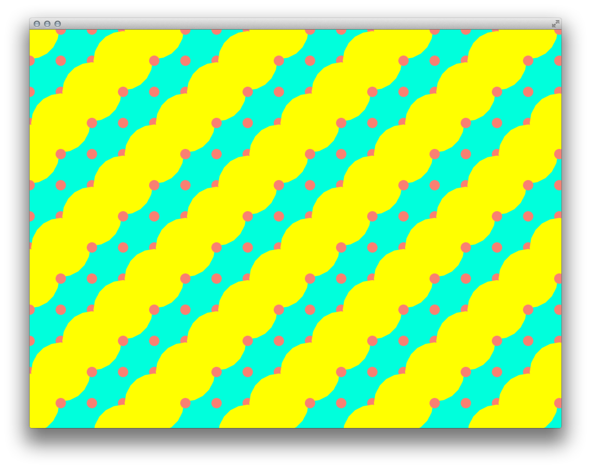

# [ofCourse][Spring 2015] Design by Code

## Description

Drawing inspiration from *Design by Numbers*, the influential project led by John Maeda at the MIT Media Lab in the 90's, this class also aims to introduce programming basics to artistis with no previous coding experience. Starting with basic 2d shapes and colors, the examples will translate basic design principles — scale, rhythm, transparency, modularity, pattern — into code.

## Instructor

[Gabriel Gianordoli](http://gianordoli.com/)  
I am a visual and interaction designer who draws with data, code, and my hands. Depending on variations of those 3 tools, my work falls into different categories: visual design, UX, data visualization, or data art.

## What is ofCourse?

[ofCourse](http://www.ofcourse.io/) is a creative coding program aimed at people with no coding skills. It provides a hands-on experience, tools, ideas, and full support for students to make their own projects.

 
## What should students bring?

* A functioning and fully charged laptop with *XCode* installed.
* openFrameworks (please download and install from the [website](http://openframeworks.cc/download/)).

## Course Overview

How can computer programming serve as a medium for visual expression? This question has been addressed by pioneers of computer arts long ago, but coding still seem as an inacessible tool for practitioners of visual arts and design today.

This class draws inspiration from 2 previous initiatives in the field. First, John Maeda's project at the MIT Media Lab in the 90's, *Design by Numbers*. Second, Ellen Lupton and Jennifer Cole Phillips' book *Graphic Design Design: The New Basics*, which presents an updated syntax of graphic design.

Students will utilize *openFrameworks*, a creative coding toolkit that makes it easy to create interactive visuals in C++. Participants will be encouraged to draw and code, experimenting with visual sketches for each theme.

## Syllabus

### 1. Introduction:
* computer arts
* generative art
* generative design

### 2. Basic Design Elements

#### A) Point, Line, Plane

* point
	* cartesian coordinates
	* ofCircle(), ofNoFill(), ofFill()
* line
	* ofLine()
	* ofSetLineWidth()
* plane
	* ofRect()
	* ofSetCircleResolution()
	* ofBeginShape(), ofEndShape(true/false), ofVertex()

	
#### B) Color

* ofSetColor(gray, a), ofSetColor(r, g, b, a), ofSetHexColor()
* ofColor::presets, *colorsExtended* example
* ofColor, setHsb()

#### C) Typography

* *data* folder, ofTrueTypeFont, loadFont(), drawString()
* \n
* setLetterSpacing(), setLineHeight(), setSpaceSize()
* ofRectangle, getStringBoundingBox()

	
#### D) Image

* raster
	* jpg, ofImage, loadImage(), resize()
	* png, ofSetColor()
* vector
	* addons, ofxSvg, #include "ofxSvg.h"

### 3. The New Basics of Graphic Design

#### A) Scale
* mouseX, mouseY
* ofPushMatrix(), ofPopMatrix(), ofTranslate()
* ofMap()
* ofScale()

#### B) Texture
* for(){}
* ofSeedRandom()

#### C) Pattern
* for(){ for(){} }

#### D) Modularity
* ofPath, arc()
* if(), %
* ofRotate()

#### E) Rhythm
* ofGetFrameNum()

#### F) Transparency
* ofEnableAlphaBlending(), ofDisableAlphaBlending()
